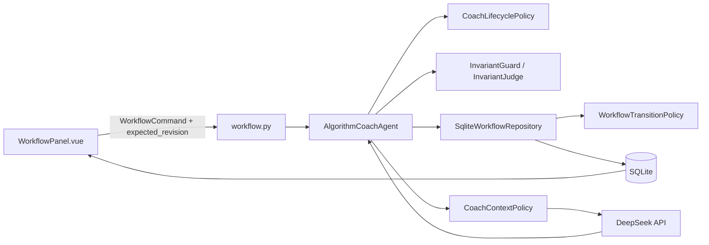

# День 15: архитектура контролируемой Task State Machine

## 1. Назначение

Задача дня 15 требует не просто попросить LLM следовать этапам, а хранить и
проверять жизненный цикл задачи на backend. Модель помогает подготовить текст,
но не имеет права самостоятельно изменить фазу.

Основная последовательность:

```text
planning → execution → validation → done
```

Допустимые возвраты:

```text
validation → execution   (вернуть решение на доработку)
execution  → planning    (перепланировать)
validation → planning    (перепланировать)
```

`pause` и `resume` меняют статус, но не фазу. Состояние, артефакты и события
хранятся в SQLite и восстанавливаются после перезапуска приложения.

## 2. Главный архитектурный принцип

LLM не является state machine.

Модель может:

- обсудить задачу;
- предложить план, реализацию или отчёт проверки;
- объяснить текущее состояние, полученное от backend.

Только backend может:

- решить, доступно ли действие;
- сохранить подтверждённый артефакт;
- изменить фазу;
- поставить задачу на паузу;
- вернуть задачу назад;
- завершить задачу.

Даже если пользователь напишет «считай план принятым» или LLM ошибочно заявит,
что этап завершён, запись в `task_workflow` от этого не изменится.

## 3. Общая схема



`WorkflowTransitionPolicy` отвечает на вопрос «можно ли выполнить действие?», а
`CoachLifecyclePolicy` — «соответствует ли запрос или артефакт текущей фазе?».
Это разные проверки, и обе обязательны.

## 4. Состояния и результаты этапов

| Фаза | Что делает агент | Что нужно подтвердить | Следующая фаза |
|---|---|---|---|
| `planning` | обсуждает подход и формирует шаги | `plan` | `execution` |
| `execution` | реализует утверждённый план | `solution` с реализацией | `validation` |
| `validation` | проверяет сохранённое решение | `validation`-отчёт | `done` |
| `done` | диалог задачи закрыт | ничего | переходов вперёд нет |

Ответ в чате и подтверждённый артефакт — не одно и то же. Сначала агент создаёт
черновик, затем пользователь проверяет или редактирует его в UI и нажимает явную
кнопку подтверждения.

## 5. Классы backend

### `capabilities.task_workflow.models`

Файл: `src/capabilities/task_workflow/models.py`.

Содержит строгие Pydantic-контракты:

- `WorkflowState` — фаза, статус, текущий шаг, кандидат и revision;
- `WorkflowControl` — ссылки на актуальный план, решение и validation;
- `WorkflowArtifact` — версия подтверждённого результата этапа;
- `WorkflowEvent` — запись аудита перехода;
- `TransitionOption` — доступность действия и причина запрета;
- `WorkflowCommand` — команда клиента с `expected_revision`.

`extra='forbid'` запрещает незаявленные поля в командах и ответах.

### `WorkflowTransitionPolicy`

Файл: `src/capabilities/task_workflow/policy.py`.

Это единая таблица разрешений state machine. Она вычисляет доступность:

- `pause` / `resume`;
- `accept_plan`;
- `accept_solution`;
- `accept_validation`;
- `select_step`;
- `request_changes`;
- `request_replan`.

UI получает рассчитанные разрешения для удобства, но backend повторяет ту же
проверку при POST-запросе. Скрытие или ручная подмена кнопки не обходит policy.

### `CoachLifecyclePolicy`

Файл: `src/agents/algorithm_coach/lifecycle_policy.py`.

Это политика конкретного алгоритмического агента. Она:

- блокирует просьбу написать код во время `planning`;
- не разрешает проверку до сохранения решения;
- предлагает явный `request_replan`, если в поздней фазе просят новый план;
- предлагает `request_changes`, если во время validation просят изменить код;
- отвечает на вопросы о фазе напрямую из workflow, без LLM;
- классифицирует явный запрос как `planning`, `execution` или `validation`;
- разрешает сделать ответ кандидатом только для текущей фазы; при разговорной
  формулировке дополнительно определяет тип по структуре ответа — заголовку и
  нумерованным шагам плана, блоку кода или признакам отчёта проверки;
- отклоняет ответ LLM, если для `execution` в нём нет реализации или для
  `validation` нет признаков отчёта проверки;
- проверяет, что solution содержит реализацию, а validation похожа на отчёт
  проверки.

Классификатор намерения локальный и детерминированный. Ложное отрицание может не
показать кнопку подтверждения, но не позволит сохранить артефакт неправильного
типа. Для нового способа формулировки достаточно расширить эту политику, не меняя
репозиторий и state machine.

### `AlgorithmCoachAgent`

Файл: `src/agents/algorithm_coach/agent.py`.

Это оркестратор одного запроса. Он не хранит фазу в полях Python-объекта. Перед
каждым действием состояние заново читается из SQLite.

Основные методы:

- `run()` — принимает сообщение, собирает контекст, вызывает политики и LLM;
- `apply_workflow()` — проверяет и подтверждает переход;
- `save_problem()` — меняет условие и сбрасывает активную цепочку в planning;
- `preview()` — рассчитывает контекст без изменения состояния.

На каждый conversation используется локальный `asyncio.Lock`. Межпроцессную и
межвкладочную конкуренцию дополнительно контролирует revision в SQLite.

### `CoachContextPolicy`

Файл: `src/agents/algorithm_coach/context_policy.py`.

Собирает prompt из:

1. системной инструкции агента;
2. актуального серверного workflow;
3. активных инвариантов;
4. профиля;
5. условия и рабочей памяти;
6. актуальной цепочки артефактов;
7. короткого хвоста переписки;
8. текущего запроса.

Серверный снимок workflow добавляется в system message. Он имеет приоритет над
старыми ответами из истории вроде «мы ещё в planning».

Чтобы длинная история не перевесила раннюю системную инструкцию, тот же снимок
повторяется отдельным system message непосредственно перед текущим запросом.
Если модель всё равно отвечает для старой фазы, backend выполняет ровно одну
корректирующую попытку. Обе попытки учитываются в токенах и стоимости.

После перепланирования старые артефакты остаются в аудите, но не попадают в
активную цепочку prompt.

### `InvariantGuard` и `InvariantJudge`

Файлы:

- `src/capabilities/invariants/service.py`;
- `src/agents/algorithm_coach/llm_judge/invariants.py`.

Проверяют обязательные правила дня 14 до основного ответа, после ответа и перед
сохранением отредактированного артефакта. Judge не меняет фазу. Не относящийся к
правилу запрос получает `pass`; `conflict` блокирует результат; техническая
неопределённость работает fail-closed.

### `SqliteWorkflowRepository`

Файл: `src/infrastructure/sqlite_task_workflow.py`.

Это источник истины и транзакционная граница. Репозиторий:

- читает задачу только в области `agent_id + conversation_id`;
- строит `WorkflowWorkspace`;
- повторно проверяет `expected_revision`;
- повторно вызывает `WorkflowTransitionPolicy`;
- создаёт версионный артефакт;
- связывает solution с plan, а validation с solution;
- обновляет control и state в одной транзакции;
- записывает событие аудита;
- сохраняет исторические версии при возвратах.

### `SqliteMemoryLayerRepository.append_reply`

Файл: `src/infrastructure/sqlite_memory_layers.py`.

Сохраняет ответ ассистента. Если ответ является результатом текущей фазы, его
message ID атомарно устанавливается как `candidate_message_id`. Установка и
сброс кандидата увеличивают workflow revision. Благодаря этому старая вкладка не
может подтвердить предыдущий черновик после появления нового.

### HTTP-слой

Файл: `src/application/routes/workflow.py`.

- `GET .../workflow` возвращает полное состояние;
- `POST .../workflow/actions` принимает `WorkflowCommand`.

Route не реализует бизнес-правила: команда передаётся агенту, а затем repository.

### Composition root

Файлы:

- `src/application/bootstrap.py`;
- `src/agents/algorithm_coach/factory.py`.

Здесь агент получает реализации памяти, workflow repository, invariant guard,
контекстные и lifecycle-политики. HTTP-слой не знает о конкретном провайдере LLM.

## 6. Таблицы SQLite

### `task_workflow`

Хранит текущую фазу и статус:

- `phase`;
- `status`;
- `current_step_id`;
- `candidate_message_id`;
- `revision`.

### `task_lifecycle_control`

Хранит активную цепочку подтверждений:

- `approved_plan_id`;
- `current_solution_id`;
- `current_validation_id`;
- версии условия и инвариантов, для которых принят план;
- `validation_solution_id`;
- последнее замечание на доработку.

### `task_artifacts`

Хранит неизменяемые версии `plan`, `solution` и `validation`.

`based_on_artifact_id` образует цепочку:

```text
plan v1 ← solution v1 ← validation v1
```

При доработке может появиться:

```text
plan v1 ← solution v1
        ↖ solution v2 ← validation v1
```

### `task_workflow_events`

Хранит аудит переходов: действие, прежнюю и новую фазу, статус, revision и время.

## 7. Алгоритм обработки сообщения

```text
1. Получить lock текущего conversation.
2. Прочитать conversation, память, workflow и invariants.
3. Проверить, что задача не paused и не done.
4. Определить намерение запроса относительно фазы.
5. Сохранить пользовательское сообщение.
6. Если это служебный вопрос или локальный отказ — сохранить локальный ответ.
7. Если явно запрошен новый результат текущей фазы, сбросить прежний candidate
   и обновить revision. Обычное уточнение не уничтожает готовый черновик.
8. Проверить input по обязательным правилам.
9. Собрать prompt с актуальным workflow в system message.
10. Вызвать основную LLM.
11. Проверить, соответствует ли output текущей фазе и типу результата.
12. При несоответствии один раз повторить вызов с корректирующей инструкцией
    backend и актуальным workflow.
13. Проверить итоговый output по lifecycle и invariants.
14. Если запрос относится к текущей фазе, сохранить ответ как candidate.
15. При установке candidate увеличить workflow revision.
```

Вопрос «в какой мы фазе?» завершается на шаге 6: DeepSeek не вызывается, токены
не расходуются, кандидат не заменяется.

## 8. Алгоритм подтверждения перехода

```text
1. UI отправляет action, content и expected_revision.
2. Agent повторно читает WorkflowWorkspace.
3. Несовпавший revision даёт HTTP 409 state_conflict.
4. WorkflowTransitionPolicy проверяет допустимость action.
5. CoachLifecyclePolicy проверяет тип содержимого артефакта.
6. InvariantGuard проверяет обязательные правила.
7. Repository открывает BEGIN IMMEDIATE.
8. Repository ещё раз читает и проверяет состояние.
9. Создаётся артефакт нужной версии и связь based_on_artifact_id.
10. Обновляются control, phase, current step и revision.
11. Создаётся WorkflowEvent.
12. Транзакция фиксируется, UI получает свежий Workspace.
```

Проверка выполняется дважды намеренно: ранняя проверка даёт понятную ошибку, а
повторная внутри транзакции защищает данные от гонок.

## 9. Пауза, возврат и изменение задачи

### Пауза

`pause` меняет только `status=paused`. Фаза, шаг, candidate и артефакты остаются.
Во время паузы диалог и подтверждения заблокированы. `resume` возвращает
`status=active`.

### Доработка

`request_changes` разрешён только из validation:

- фаза становится execution;
- validation перестаёт быть активной;
- замечание сохраняется в `change_request`;
- предыдущий solution остаётся исторической базой для новой версии.

### Перепланирование

`request_replan` разрешён из execution или validation:

- фаза становится planning;
- активные ссылки plan/solution/validation очищаются;
- старые версии остаются в `task_artifacts`;
- новый переход невозможен до принятия нового плана.

### Изменение условия или правил

Изменение условия возвращает активную задачу в planning. Инварианты можно менять
только во время активного planning; изменение правил аннулирует candidate и
увеличивает revision.

## 10. Что показал аудит последнего диалога

Последний завершённый чат был создан до усиления фазовой типизации. Последовательность
фаз формально соблюдалась, но содержимое артефактов было неправильным:

- `plan v1` был создан из ответа о невозможности перейти к реализации;
- `solution v1` содержал объяснение, что решение ещё не сохранено;
- `validation v1` содержал новый план вместо отчёта проверки.

Причина: любой последний ответ LLM становился candidate текущей фазы, даже если
пользователь спрашивал о статусе или просил результат другого этапа. Клиент также
мог извлечь пункты из неподходящих маркированных списков.

Исправления:

1. `CoachLifecyclePolicy` сопоставляет явный запрос с фазой.
2. Запрос результата другого этапа обрабатывается локально и не заменяет candidate.
3. Статусные и управляющие вопросы сохраняют корректный текущий черновик.
4. Backend проверяет тип solution и validation перед сохранением.
5. UI извлекает только нумерованные строки секции «Шаги».
6. Смена candidate увеличивает revision и защищена optimistic locking.
7. Candidate читается только из сообщения того же conversation.

Исторические артефакты уже завершённого чата намеренно не переписываются задним
числом: иначе аудит перестал бы отражать реально выполненные действия. Для
проверки исправленной версии нужно создать новый чат.

Повторный аудит нового чата выявил ещё два пограничных случая:

- подробный план с вложенными маркерами UI сокращал до первого верхнеуровневого
  шага;
- после перехода в `execution` DeepSeek получил правильный серверный снимок, но
  выбрал устаревшее утверждение `planning` из истории, а неподходящий ответ стал
  кандидатом решения.

Парсер UI теперь пропускает вложенные пояснения и собирает все нумерованные
верхнеуровневые шаги. Актуальное состояние повторяется в конце контекста, а
фазовый output guard не позволяет тексту о planning стать solution. При первом
нарушении выполняется одна автоматическая попытка исправления; при повторном
нарушении кандидат не создаётся и состояние не меняется.

## 11. Гарантии и границы

Жёстко гарантируется backend:

- порядок обязательных фаз;
- невозможность принять action без candidate нужной фазы;
- актуальность plan относительно условия и инвариантов;
- связь solution с plan и validation с solution;
- отсутствие перехода по устаревшему revision;
- восстановление состояния после перезапуска;
- запрет диалога в paused и done.

Не является формальным доказательством:

- корректность алгоритма, написанного LLM;
- полнота ручной проверки модели;
- семантическое качество текста validation.

Локальная фазовая классификация намеренно консервативна. Неизвестная формулировка
может не создать candidate; это безопасный отказ, а не незаконный переход. В
будущем её можно заменить структурированным LLM-output или отдельным classifier,
не меняя state machine и SQLite-модель.

LLM не запускает код. `llm_review` означает ручной анализ модели. Фактический
результат запуска пользователь сохраняет с методом `user_test_result`.

## 12. Автоматические проверки

Основные сценарии находятся в:

- `tests/test_day13_workflow.py` — базовая FSM, пауза и восстановление;
- `tests/test_day14_invariants.py` — обязательные правила;
- `tests/test_day15_controlled_transitions.py` — версии, возвраты, запрет
  перескоков, фазовая типизация и защита от устаревшего candidate;
- `ai-agents-client/src/features/workflow/WorkflowPanel.test.js` — UI и парсинг
  артефактов.

Backend:

```powershell
cd ai-agents-backend
.\.venv\Scripts\python.exe -m pytest
```

Frontend:

```powershell
cd ai-agents-client
pnpm test
```
